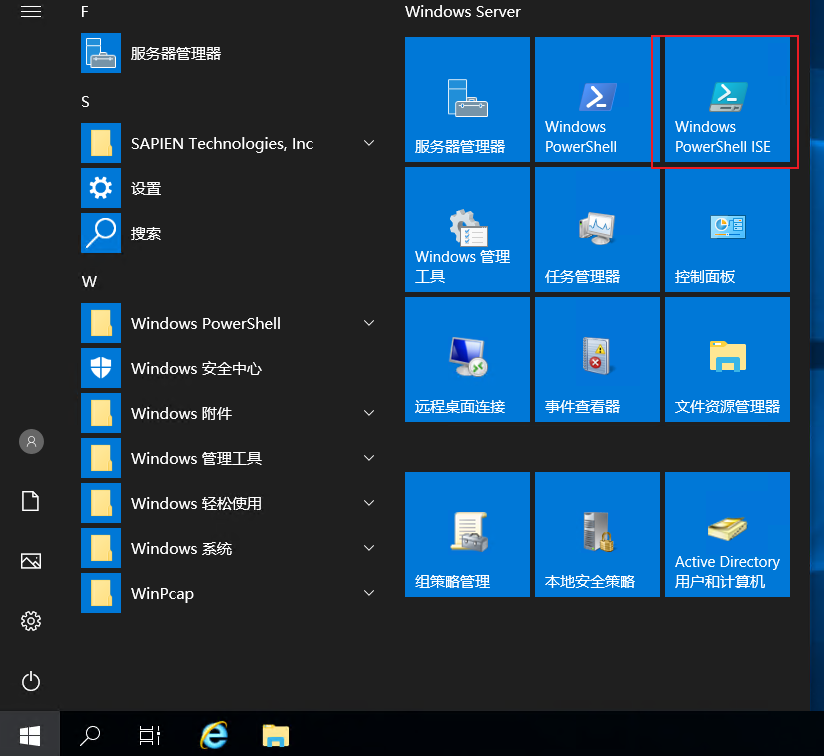
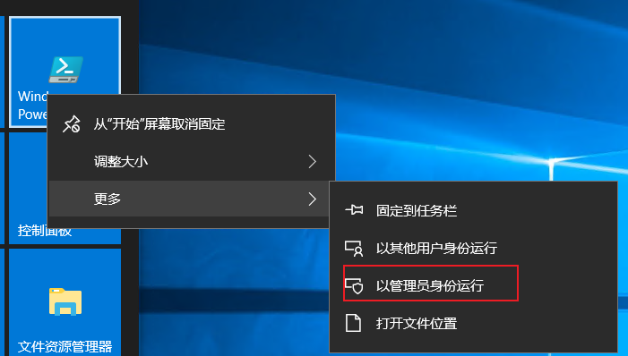
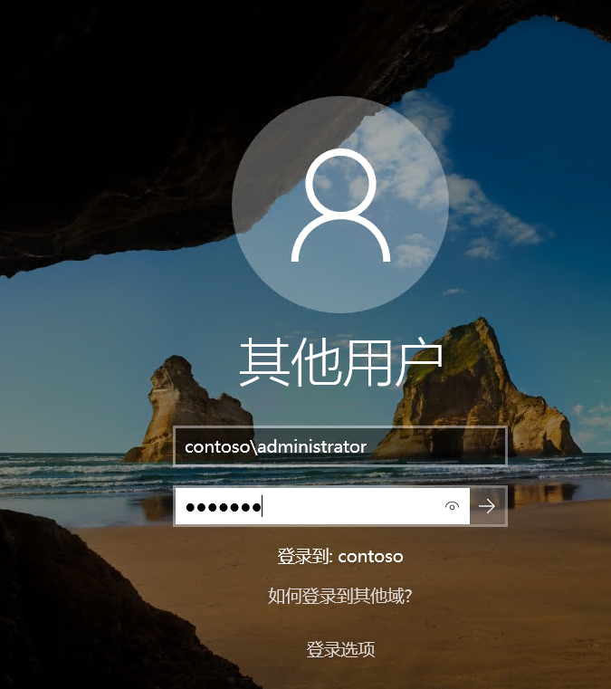

# Active Directory域控制器

创建 一台虚拟机，进行如下配置，这是POC环境中`第一台`可用的虚拟机。

> 注意：由于使用了`内部网路`类型的虚拟交换机，此处做任何配置网络配置都是可以未来通过软路由来通信的。

| 虚拟机主机名称 | 功能     | IP          | 掩码          | 网关        | CPU  | 内存 | 硬盘 |
| -------------- | -------- | ----------- | ------------- | ----------- | ---- | ---- | ---- |
| POC-DC01       | 域控制器 | 192.148.0.2 | 255.255.255.0 | 192.148.0.1 | 1    | 1G   | 标配 |

注意：

- 如果在物理环境配置，且主机存在多网卡，`必须`将没有使用的网卡`禁用`
- 不要关闭Active Directory的操作系统的IPV6功能。

## 部署

Active Directory是一个重要的角色，牵扯到的应用过多，此处不进行扩展。在SDDC体系中，Active Directory提供整个环境的账号认证实现，且`唯一不可替代`。

使用下述方法，打开`管理员的PowerShell`（下文多数情况下指的是以`管理员方式打开Winows PowerShell ISE`）

 - 点击左下角开始键，找到Winows PowerShell ISE



 - 右键点击，依次选择更多→以管理员身份运行。



 - 复制以下PowerShell代码。此处使用密码`poc.123`

```powershell
		Install-WindowsFeature ad-domain-services -IncludeAllSubFeature -IncludeManagementTools;
		Import-Module ADDSDeployment
		$DomainName = “contoso.com”
		$DomainNetbiosName = “contoso”
		$password = ConvertTo-SecureString  "poc.123" -AsPlainText -Force
		Install-ADDSForest -CreateDnsDelegation:$false -DatabasePath "C:\Windows\NTDS" `
						   -DomainMode WinThreshold -DomainName $DomainName -DomainNetbiosName $DomainNetbiosName `
						   -ForestMode "WinThreshold" -InstallDns:$true -LogPath "C:\Windows\NTDS" `
						   -NoRebootOnCompletion:$false -SysvolPath "C:\Windows\SYSVOL" -Force:$true  `
						   -SafeModeAdministratorPassword $password
 
```

 - 选中代码，点击F8执行。


## 检查

等待虚拟机自动重启后，如登录界面变成如下形态，即表示安装成功

输入账号`contoso\administrator`，密码`poc.123`进行登录。




## 课后系统

- 搜索或者尝试一下，关闭Active Directory操作系统的IPV6功能，会有什么问题
