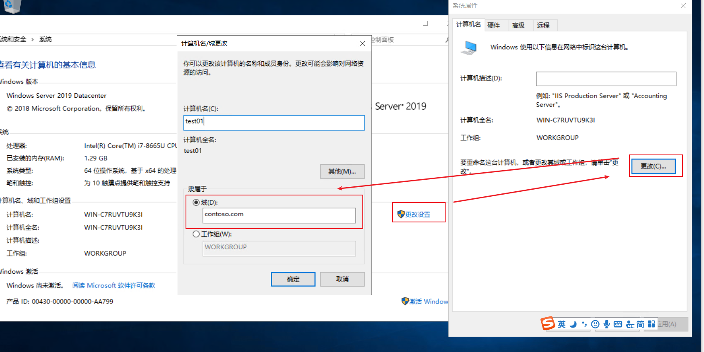
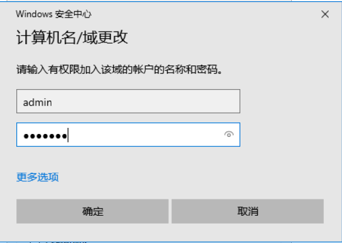
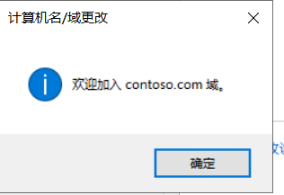

# 计算机加域

整个POC环境中，除了创建第一台虚拟机（Active Directory）和软路由（DCGW）没有`加域`操作，其他所有虚拟机/主机都需要执行该操作。

## 目的

加域是为了让独立的计算机能够使用Active Directory提供的身份认证和主机认证功能，是POC的`必要条件`

## 操作

正常安装完成操作系统后，首先`修改计算机名称`，以及计算机的IP地址、网关、掩码、DNS，必须与`账号体系约定`一致。

错误的IP配置信息，会导致无法加域

在待加域的计算机中，打开`文件资源管理器`，于地址栏输入`控制面板\系统和安全\系统`点击回车。

依次执行如下操作

`计算机、域和工作组设置`右侧的`更改设置→`

`弹窗中点击更改→`

`弹窗中点击隶属于下的“域”`→

`输入域名`

在弹出的窗口中，输入`域管理员`，并点击确定，完成加域。

## 检查

正常加域，会弹出如下提示，表示操作成功。完成后，请`重启`一次该主机。

