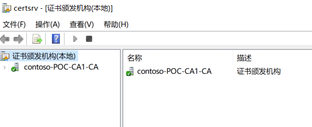

# 证书服务器

完成`第一台计算节点`的创建后，可以开始创建`证书服务器`。创建 一台虚拟机，进行如下配置。

证书服务器为SDN中的NC和MUX提供证书认证功能，属于`必须环节`。该环节和`DCGW`部署属于并置阶段，不严格区分先后。


| 虚拟机主机名称 | 功能       | IP           | 掩码          | DNS         | 网关        | CPU  | 内存 | 硬盘 |
| -------------- | ---------- | ------------ | ------------- | ----------- | ----------- | ---- | ---- | ---- |
| POC-CA1        | 证书服务器 | 192.148.0.17 | 255.255.255.0 | 192.148.0.2 | 192.148.0.1 | 1    | 1G   | 默认 |

## 安装与角色

使用`域管理员`登录`POC-CA1`，安装证书服务器角色

```powershell
Install-WindowsFeature Adcs-Cert-Authority -IncludeManagementTools
```

默认配置安装企业根CA

```powershell
Install-AdcsCertificationAuthority -CAType EnterpriseRootCa
```

如上两条命令会配置一个有效期5年的使用SHA256加密的证书颁发机构。

运行`certsrv.msc`打开证书颁发机构


