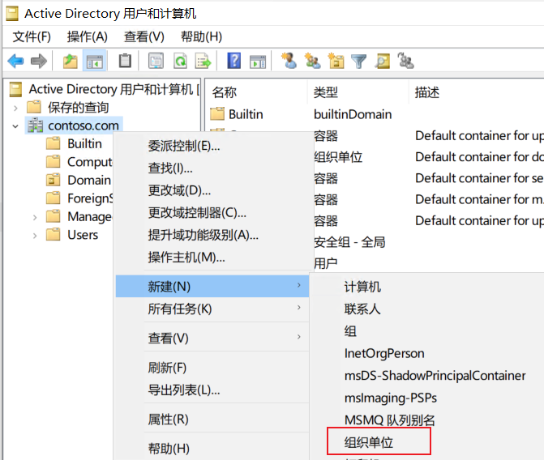
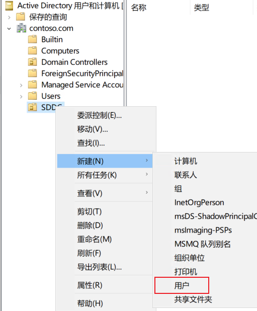
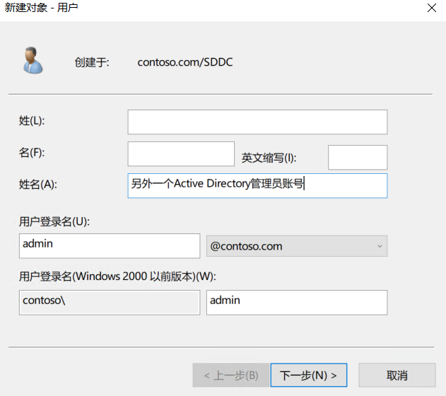
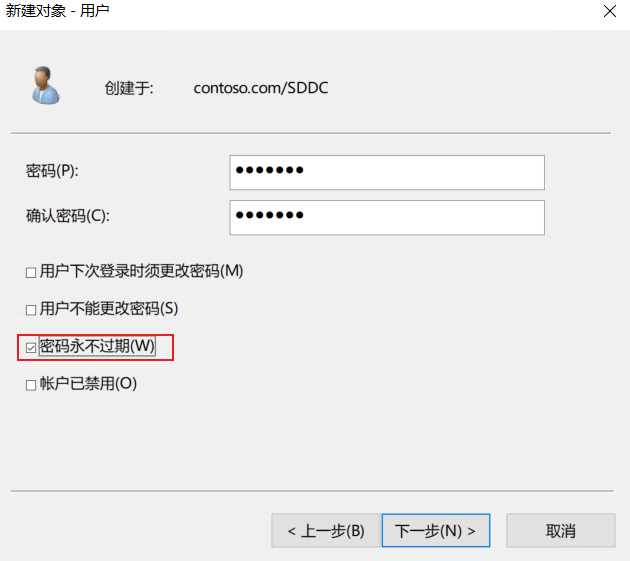
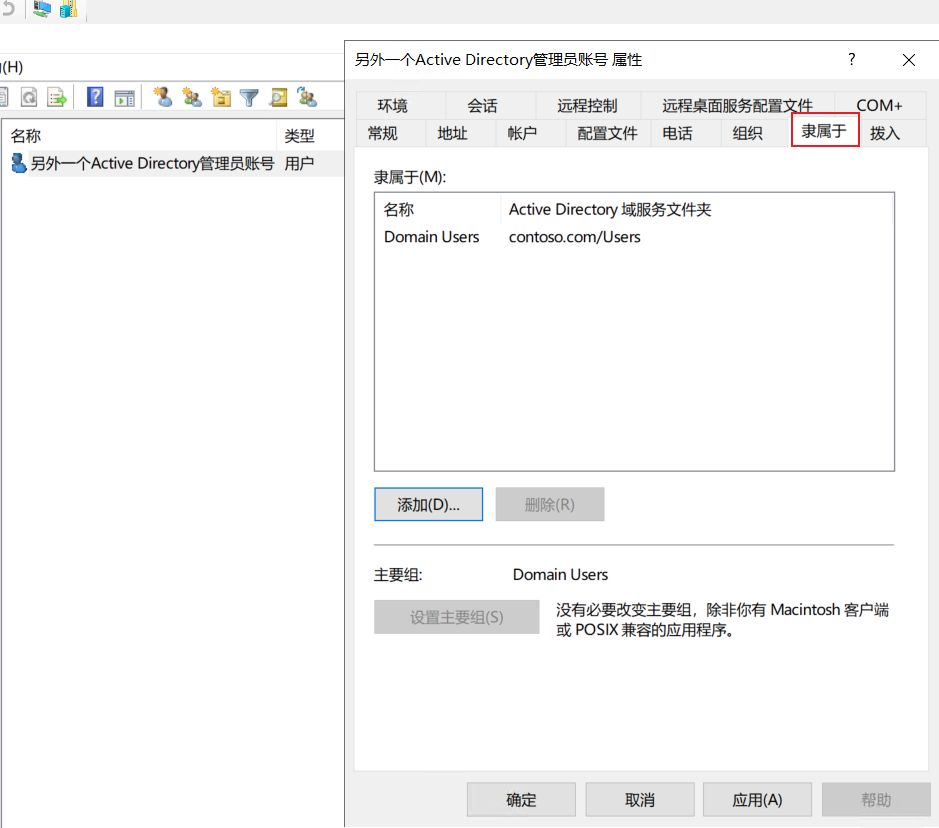
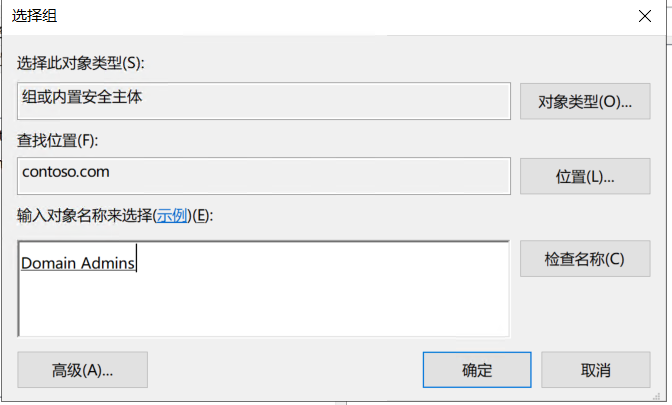
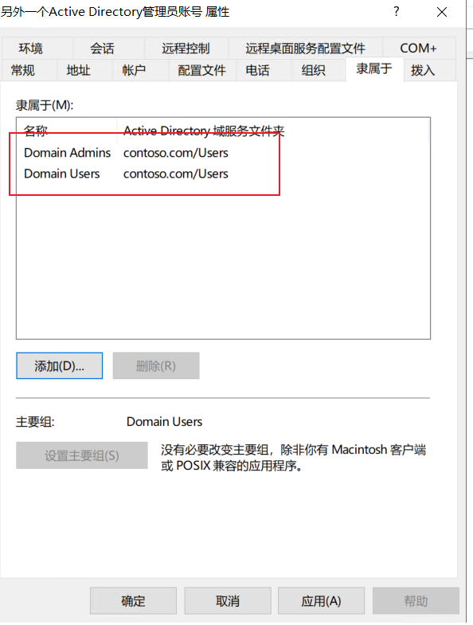

# 创建额外的AD账号

完成Active Directory域的创建后，需要额外创建一些账号，用来承载特定的业务。

本章节实现3个操作，需要通过这3个操作，完成`账号体系约定`章节所需要的账号。

- 创建OU
- 创建用户
- 将用户添加到特定安全组

## 创建OU（Organizational Units）

创建OU是为了便于组策略的发布，以及逻辑上的人为管理。OU的作用类似于磁盘系统中的`目录`，是一种逻辑容器。

在Active Directory域控制器上，打开`Active Directory用户和计算机`,依次点击`contoso.com→右键新建→组织单位`

在弹出的窗口中，输入`SDDC`,点击确定。如果需要创建计算机账号，亦在此操作，上一阶段选择`计算机`即可。

## 创建新用户

正常情况，在当前域下，已经可以看到创建的`SDDC` OU了，此时在`SDDC`上右键点击，依次点击`新建→用户`

按照下图，输入账号信息，账号命名为`admin`。接下里如果指代`域管理员`,则特指`contoso\admin`这个账号。

> 不建议直接使用默认的administrator账号。理由如下：
>
> - 默认的AD域的administrator和本地administrator同名，对AD不了解的朋友，很容易错误的理解和输入这两者。
> - 使用默认账户权限太高，存在安全风险
> - SDDC基于Role-based access control (RBAC)来部署，不需要所有场景都使用administrator。

 配置完成输入密码时，请勾选`密码永不过期`。

## 将账户添加到特定组，升级为域管理员

双击创建的账号，在弹出的窗口中选择`隶属于`，点击`添加`。

在弹出的窗口中选择输入`domain admins`，点击确定。

返回属性界面，可以看到`隶属于`下已经出现了刚才添加的安全组，表示配置完成。

## 检查

