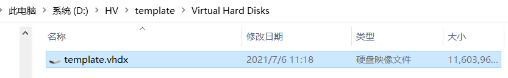
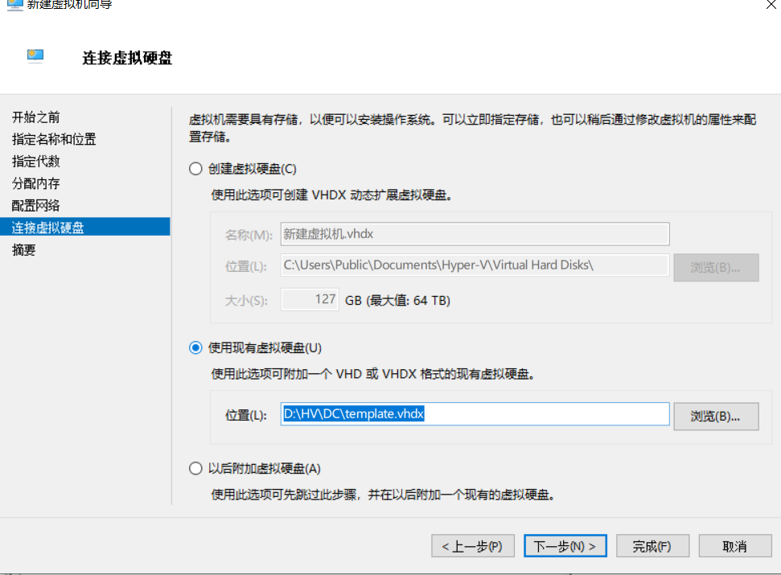

# 创建虚拟机模板

当完成`第一台虚拟机`的操作后，我们访问`D:\HV\template\Virtual Hard Disks`，可以看到这里有一个VHDX文件，如下图所示。

将该文件`拷贝出来作为模板备用`，同时返回`Hyper-V管理器`，选中该虚拟机，右键点击，选择`删除`，返回`D:\HV\template`，删除整个目录。

## 通过模板创建虚拟机

拥有VHDX文件后，接下来创建虚拟机的速度可以加快。使用`第一台虚拟机`的创建操作，在连接虚拟硬盘阶段，不用选择`创建虚拟磁盘`，使用`使用现有虚拟磁盘`，文件指向拷贝的模板即可。

需要注意：

- 为每一台虚拟使用一个新的目录
- 在`每一个目录`中，拷贝一份`template.vhdx`
- 单一文件模板不可公用，该场景下公用即损坏。

## 检查

能够通过模板创建虚拟机即可。

