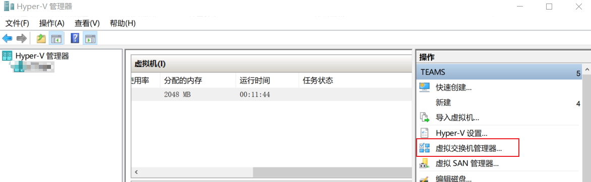
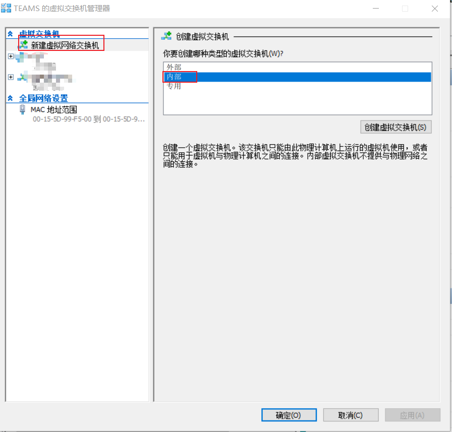
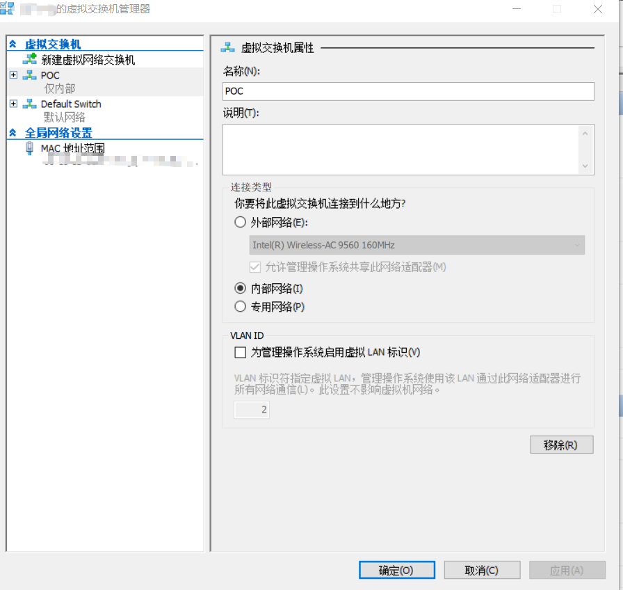

# 启用Hyper-V虚拟交换机

安装完成Hyper-V角色后，打开`Hyper-V管理器`,点击`虚拟交换机管理器`

在新窗口中，依次点击`新建虚拟网络交换机→内部`，点击`创建虚拟交换机`。

注意选项和命名（POC），进行如图所示配置，并点击确定。

## 检查

重新打开`虚拟交换机管理器`，应该可以看到一个名为`POC`的内部网络类型的虚拟交换机。

## 课后习题

虚拟交换机的属性，这三种配置有什么不同。

- 外部
- 内部
- 专用
