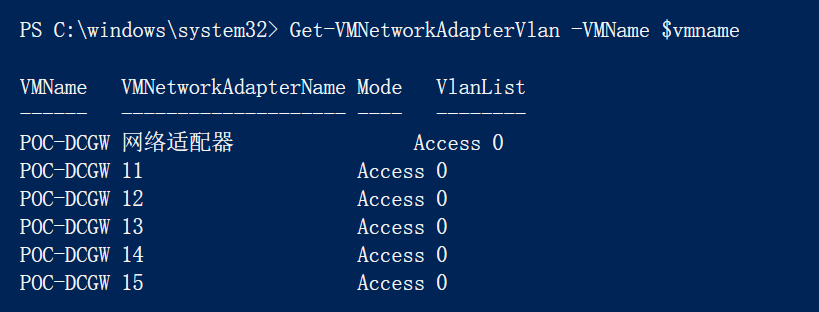

# 部署RRAS的软路由

完成`第一台计算节点`的创建后，可以开始创建`DCGW`虚拟机。由于接下来需要为部署SDN做准备，因此在这个阶段，软路由需要提前准备好。

| 虚拟机主机名称 | 功能       | IP          | 掩码          | DNS         | 网关        | CPU  | 内存 | 硬盘 |
| -------------- | ---------- | ----------- | ------------- | ----------- | ----------- | ---- | ---- | ---- |
| POC-DCGW       | RRAS软路由 | 192.148.0.1 | 255.255.255.0 | 192.148.0.2 | 192.148.0.1 | 1    | 1G   | 默认 |

## 配置

配置过程较为繁琐，全部以脚本实现。每个阶段的返回值，以备注的方式在脚本中体现。脚本需要`逐段执行`。

脚本在环境的`Host节点`执行，使用[PowerShell Direct ](https://docs.microsoft.com/en-us/virtualization/community/team-blog/2015/20150514-powershell-direct-running-powershell-inside-a-virtual-machine-from-the-hyper-v-host)来完成和虚拟机之间的通信。

```powershell
#输入DCGW的账号密码
$cred = Get-Credential
$vmname = "poc-dcgw"
#验证主机是否已开机，开机应该返回虚拟机的名称
Invoke-Command -VMName $vmname -Credential $cred { $env:COMPUTERNAME }
#安装RRAS，大概率不需要重启。但仍然需要耐心等待脚本完成安装
Invoke-Command -VMName $vmname -Credential $cred { Install-WindowsFeature RemoteAccess -IncludeAllSubFeature -IncludeManagementTools -Restart }
#创建检查点，在使用检查点之前，需要开启检查点功能，同时设置检查点为'标准'
Get-VM -Name $vmname | Checkpoint-VM -SnapshotName "完成功能安装"


#默认网卡改名
Invoke-Command -VMName $vmname -Credential $cred { Get-NetAdapter -Name "以太网*" | Rename-NetAdapter -NewName "0" }
#增加5张网卡，由于WMI调用的问题，出错之后，不见得可以重新配置。需要还原到上一个检查点继续
#xx.1的地址会被SDN自动占用，因此不可以将网关地址设置为靠前的地址。
11 .. 15 | ForEach-Object{
	$tempx = $_
	Add-VMNetworkAdapter -SwitchName POC -Name $tempx -VMName $vmname
	Set-VMNetworkAdapterVlan -VMName $vmname -VMNetworkAdapterName $tempx -VlanId 0 -Access
	Invoke-Command -VMName $vmname -Credential $cred {
		Get-NetAdapter -Name "以太网*" | Rename-NetAdapter -NewName $using:tempx
		$IPtemp = "192.148." + $using:tempx + ".250"
		New-NetIPAddress -InterfaceAlias $using:tempx -AddressFamily IPv4 -IPAddress $IPtemp
		Set-NetIPAddress -InterfaceAlias $using:tempx -AddressFamily IPv4 -PrefixLength 24
		Start-Sleep 1
		$IPV6temp = "2001:" + $using:tempx + "::250" #2001:xx::250
		#https://www.site24x7.com/zhcn/tools/ipv6-subnetcalculator.html
		New-NetIPAddress -InterfaceAlias $using:tempx -AddressFamily IPv6 -IPAddress $IPV6temp
		Set-NetIPAddress -InterfaceAlias $using:tempx -AddressFamily IPv6 -PrefixLength 64
		Start-Sleep 1
	}
}
#创建检查点
Get-VM -Name $vmname | Checkpoint-VM -SnapshotName "完成网卡配置"

#检查名称和VLAN配置
Get-VMNetworkAdapterVlan -VMName $vmname
#关闭防火墙
Invoke-Command -VMName $vmname -Credential $cred { Set-NetFirewallProfile -Enabled False }
#无图形界面，仅开启路由功能
Invoke-Command -VMName $vmname -Credential $cred { Install-RemoteAccess -VpnType RoutingOnly }


#无图形界面
#开启路由,调整服务启用方式，关闭防火墙，启用BGP，重启主机
icm -VMName $vmname -Credential $credgw {
	Install-RemoteAccess -VpnType RoutingOnly
	Get-Service RemoteAccess | Set-Service -StartupType Automatic
	Set-NetFirewallProfile -Enabled False
	Add-BgpRouter -BgpIdentifier 192.148.17.1 -LocalASN 65002
	#add-bgppeer -Name MUX001 -LocalIPAddress 192.148.13.250 -PeerIPAddress 192.148.13.14 -LocalASN 65002 -PeerASN 65001 -OperationMode Mixed -PeeringMode Automatic
	#add-bgppeer -Name MUX002 -LocalIPAddress 192.148.13.250 -PeerIPAddress 192.148.13.15 -LocalASN 65002 -PeerASN 65001 -OperationMode Mixed -PeeringMode Automatic
	#add-bgppeer -Name MUX003 -LocalIPAddress 192.148.13.250 -PeerIPAddress 192.148.13.16 -LocalASN 65002 -PeerASN 65001 -OperationMode Mixed -PeeringMode Automatic
	add-bgppeer -Name MUX001 -LocalIPAddress 192.148.17.1 -PeerIPAddress 192.148.12.81 -LocalASN 65002 -PeerASN 65001 -OperationMode Mixed -PeeringMode Automatic
	add-bgppeer -Name MUX002 -LocalIPAddress 192.148.17.1 -PeerIPAddress 192.148.12.82 -LocalASN 65002 -PeerASN 65001 -OperationMode Mixed -PeeringMode Automatic
	Get-Service RemoteAccess | Start-Service
	Restart-Computer -Force
}

#RRAS启动慢，如果重启之后，需要检查并启动服务
icm -VMName $vmname -Credential $credgw{
	Get-Service RemoteAccess | Start-Service
	Get-Service RemoteAccess
}


```

## 检查

脚本不报错即可，也可以登录到目标虚拟机中，检查网卡信息，看是否符合预期。


