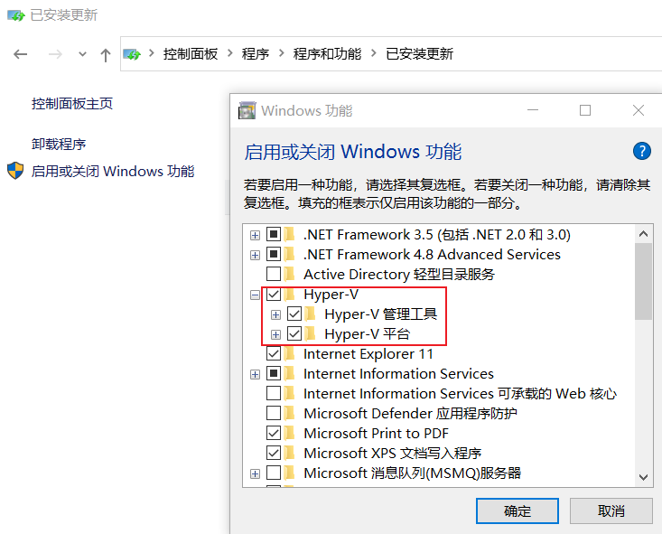
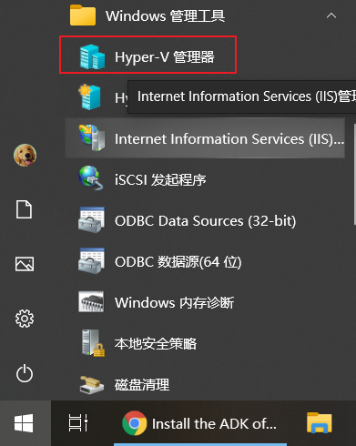

# 启用Hyper-V角色

使用`Windows 10中文版`，在物理主机/Azure的实例中，依次点击`控制面板→程序和功能→启用或关闭Windows功能`，勾选Hyper-V功能，如下图所示。点击`确定`后，重启生效。

> 如host采用Windows Server 2019，则使用如下PowerShell命令安装角色，安装完成后，同样会重启。
>
> Install-WindowsFeature Hyper-V  -IncludeAllSubFeature -IncludeManagementTools -Restart

## 检查

重启完成后，在`开始→Windows 管理工具`下，应该可以看到如下图标。

