# 第一台计算节点

## 章节目标

完成`VMM`的创建后，可以开始创建`第一台计算节点`。创建 一台虚拟机，进行如下配置。

这台计算节点是用来被VMM纳管的，接下来需要承载SDN基础架构。

| 虚拟机主机名称 | 功能      | IP          | 掩码          | DNS         | 网关        | CPU  | 内存 | 硬盘                                      |
| -------------- | --------- | ----------- | ------------- | ----------- | ----------- | ---- | ---- | ----------------------------------------- |
| POC-COMP1      | 计算节点1 | 192.148.0.9 | 255.255.255.0 | 192.148.0.2 | 192.148.0.1 | 8    | 20G  | 需要嵌套放置6-9台虚拟机，至少分配200G磁盘 |

## 部署

正常部署，根据Hyper-V的嵌套虚拟化`章节配置。

关闭`防火墙`，见`组策略`章节

## 配置本地管理员

将`computeradmin`配置为`POC-COMP01`的本地管理员。操作请参考`账号体系约定`

## VMM纳管计算节点

### Virtual Machine Manager 控制台

在`VMM`主机上，打开`Virtual Machine Manager 控制台`，服务器名称输入`服务器FQDN:8100`,如下图所示。点击`连接`

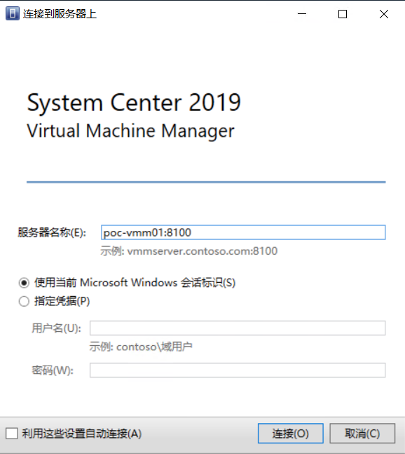

### 创建运行方式账户

打开`Virtual Machine Manager 控制台`后，依次点击`设置`,创建`运行方式帐户`

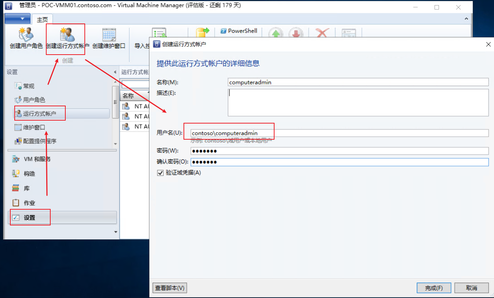

### 纳管主机

返回`VM和服务`,于`所有主机`上右键点击，选择`添加Hyper-V主机和群集`

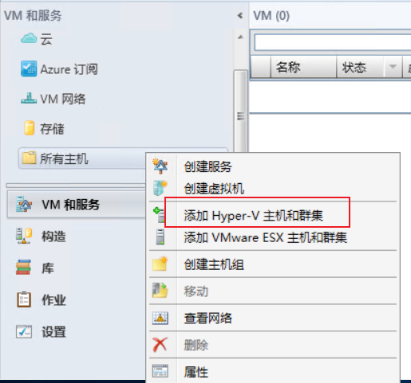

一直点击下一步，直至出现如下界面，通过`浏览`按钮，选择刚才创建的`运行方式帐户`，点击`下一步`继续。

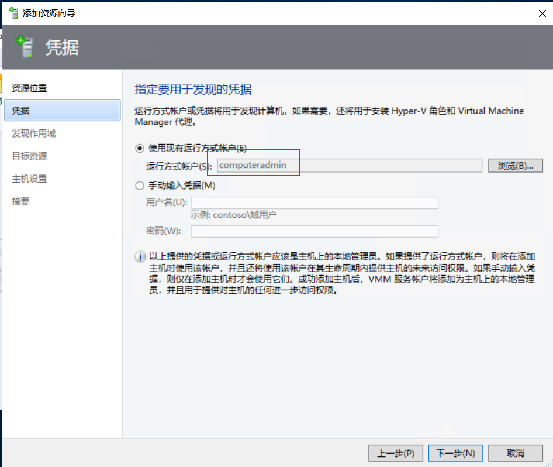

在`计算机名`框体中，输入计算节点的计算机名，点击`下一步`继续。

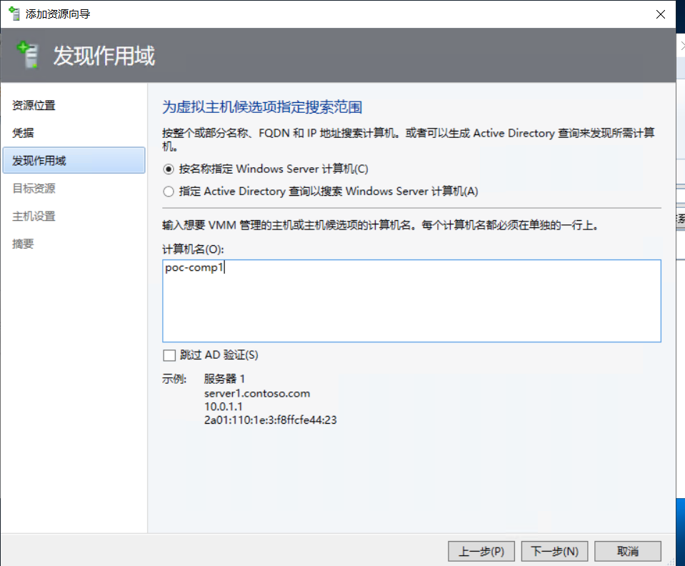

勾选目标主机，并点击`下一步`继续。

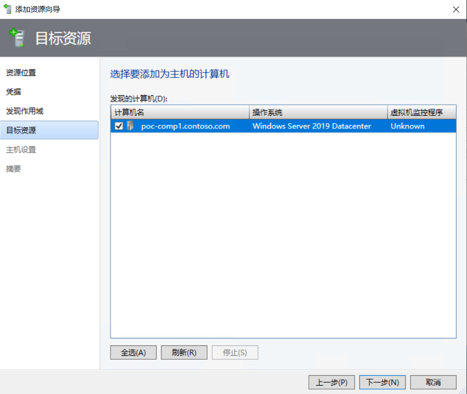

针对弹窗信息，点击`确定`继续。

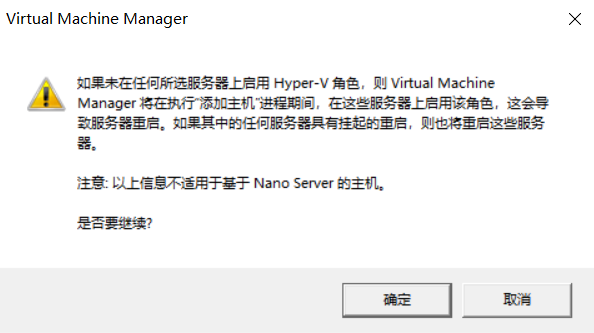

一直点击下一步，直至`完成`

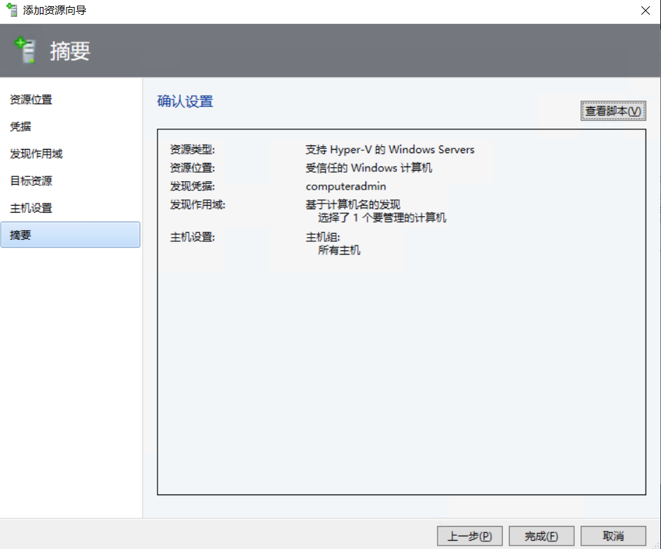

## 检查

`运行方式帐户`创建成功，会`立刻`在此处显示出对应的信息。

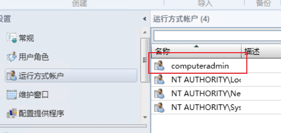

纳管成功，计算节点会位于`所有主机`下。

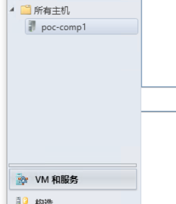

在`VMM`的`作业`中，会有如下报错，不用处理。

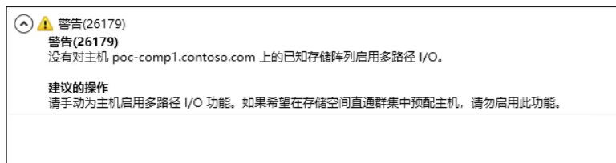

