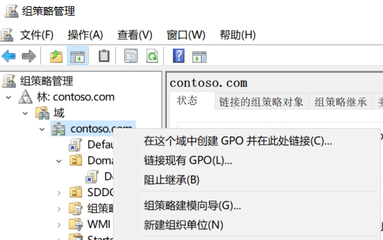
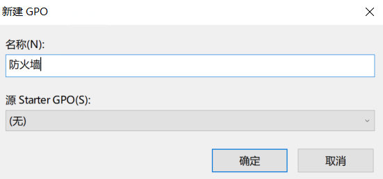
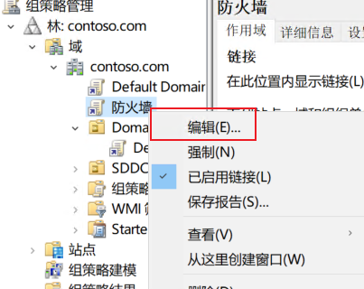
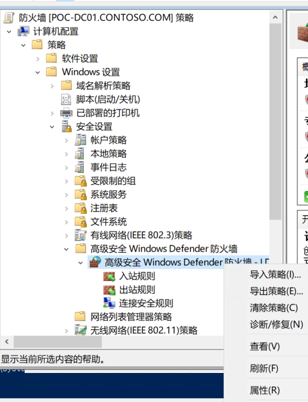
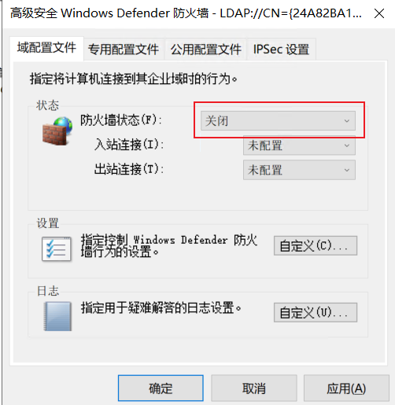
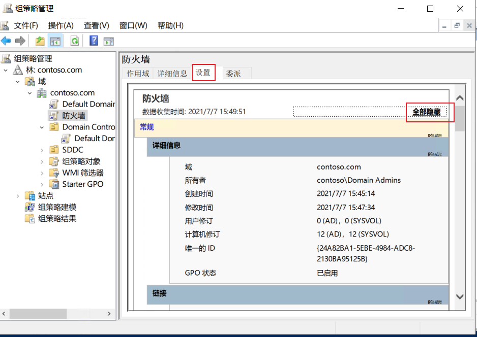
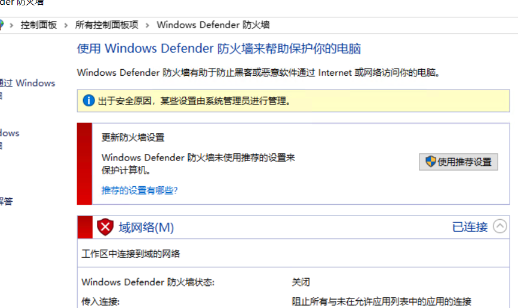

# 组策略

组策略是基于Active Directory的一种批量管理的方法，能够针对域内计算机/用户，进行基于OU的，特殊属性的批量修改。

## 配置第一条策略：关闭防火墙

该策略需要针对全员生效，打开`管理员的PowerShell`执行`gpmc.msc`。在窗口中依次点击`组策略管理→林contoso.com→域→contoso.com→右键点击→选择（在这个域中创建GPO并在此处链接）`

命名为`防火墙`，点击确定

右键点击创建的`防火墙`，并点击`编辑`

在弹出窗口中，依次点击`计算机配置→策略→Windows设置→安全设置→高级安全Windows Defender防火墙→右键点击，选择属性`

在弹出的窗口中，将`域、专用、公用`三个配置文件的防火墙设置均配置为`关闭`，点击`确定`。

## 检查

点击创建完成的组策略，于右侧窗体点击`设置→全部显示`，能看到具体的配置信息，检查这里以判断配置是否正确。

以防火墙为例，预期目标是关闭防火墙，在受控主机上查看防火墙，可以看到配置属于已经由`系统管理员进行管理`，说明配置成功。

