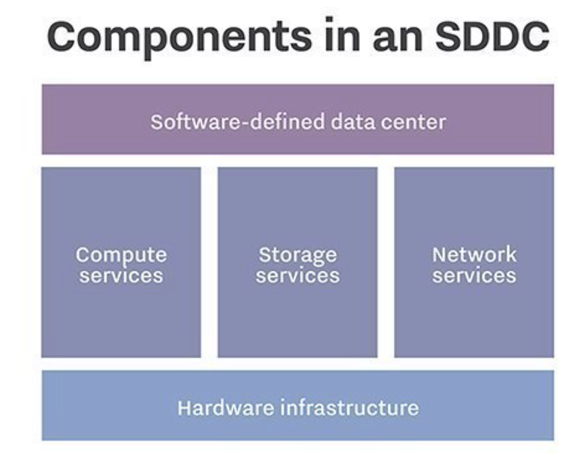

# 简介

## 背景

2013年前后，SDX（软件定义XX）广泛流行，而SDDC的概念则是集大成者。参与这方面的厂商包括Vmware、微软、IBM、HP等等，不过能够将这种理念顺利延续下来的厂商屈指可数。

顾名思义，这是一项私有云下的技术，但在最新的[Windows Server Software-Defined Datacenter](https://docs.microsoft.com/en-us/windows-server/sddc)中，Azure Stack HCI 解决方案也涵盖在内。

众所周知，Azure Stack HCI 解决方案是Azure现阶段给予很多重视的产品，而Azure Stack HCI 大量运用了SDDC的概念和技术。这两者的学习能够互补，我们可以站在不同的角度，考量产品的适用场景。

## 什么是SDDC

简言之，SDDC就是计算、存储、网络都使用软件定义的方式实现。以实现对硬件设备的解耦依赖。因此一个完整的SDDC方案，一定会包含计算、存储、网络的软件定义。

SDDC多数情况下指的是用户自建的数据中内，实现的计算存储网络的全面软件定义。

## 前置知识

全系列文章会尽量详细，读者只需要有`基本的Windows操作经验`即可。

每个人知识背景不同，理解可能也不同。如果发现部分章节的内容不易理解，请在GitHub向我提交`issues`。

本书不对SDDC概念本身，做过多扩展和深入。

## 收益

通过`纯手工`的方式搭建SDDC平台，了解基本的SDDC使用方法。

> 部署方式仅适用于POC，由于缺少必要的高可用设计，不能直接应用于生产环境。
>
> 深入的理论知识，可以参考附录的推荐章节，微软员工可以联系作者，获得内部资料链接。

## 站点图片不显示
由于众所周知的原因，Github的图床访问有时候会不显示，这个问题无法避免，需要读者开动聪明的小脑袋瓜。
## 体例

每个章节可能会包含

- 正文（技术实现）
- 检查（检查是否完成实现部分）
- 表格（规范化提供成体系的数据）
- 代码（部分实现代码）
- `一直点击下一步，直至……`（在部分场景，不存在修改配置选项的前提下，可以通过`点击下一步`继续进行的场景，则不会配图，直接跳过。）
- 课后习题（根据当前章节的学习内容，扩展出来的问题。`不提供答案`，同时问题可能在章节中没有直接答案，需要自行搜索，供扩展学习。）

## 术语表

暂无

## 许可

[MIT许可](license.md)：请任意使用全部或部分，但务必注明出处。

## 反馈

请通过[Github](https://github.com/kukisama/SDDCPOC)站点的issues来提交反馈，以及希望增加的内容，只支持`中文`。

## 保密

发布内容不涉及NDA，且主要面向初级入门，因此发布内容在特定情况下会缺少深入细节，部分设计也不会解释设计原因，但原则上不会影响阅读。

