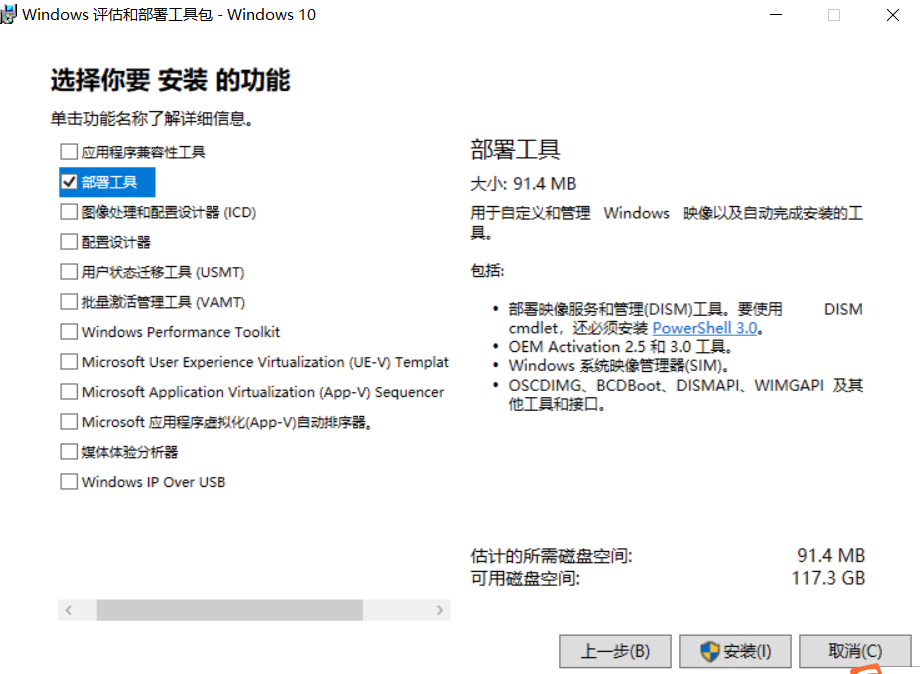
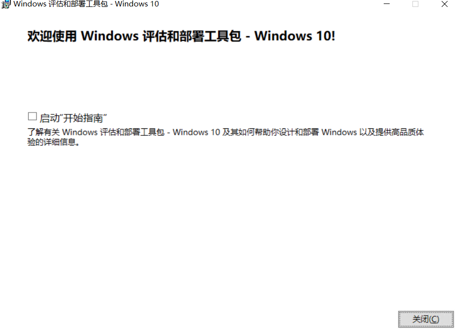
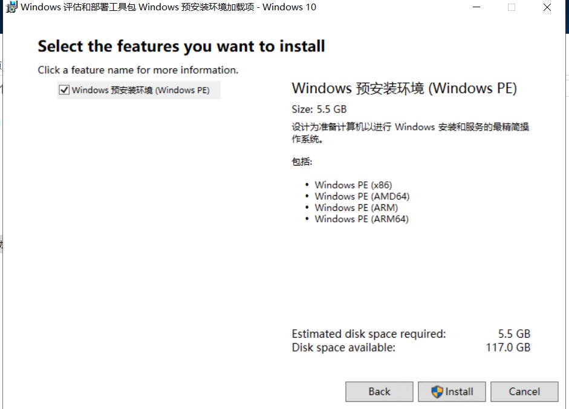
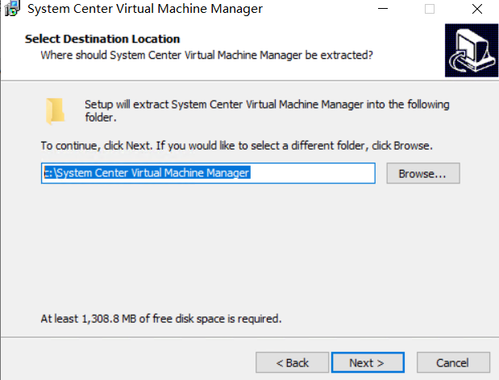
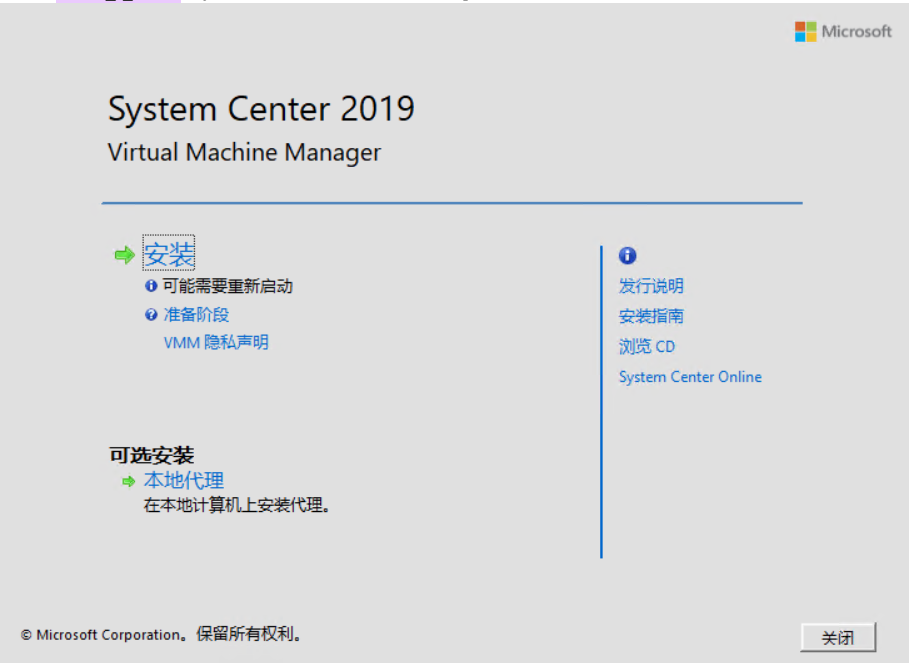
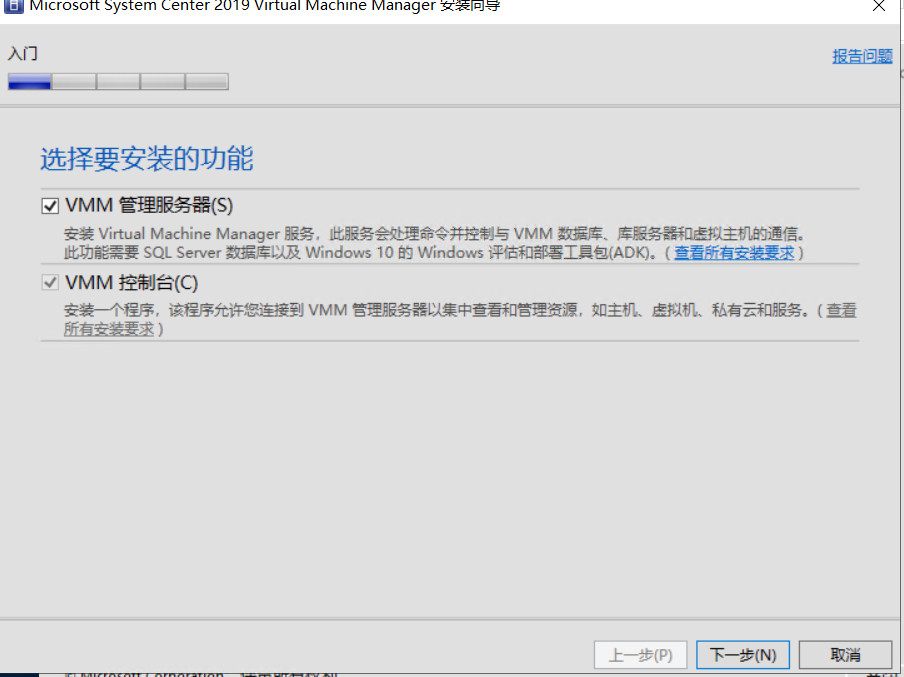
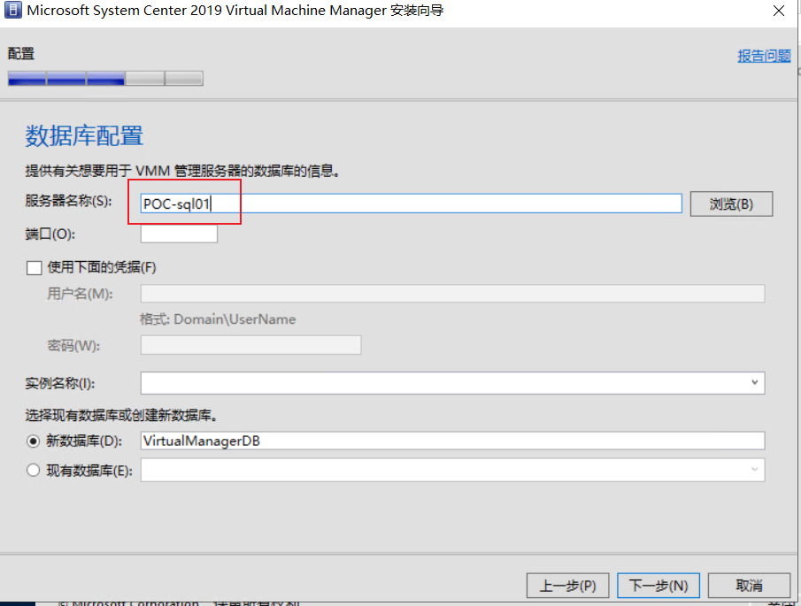
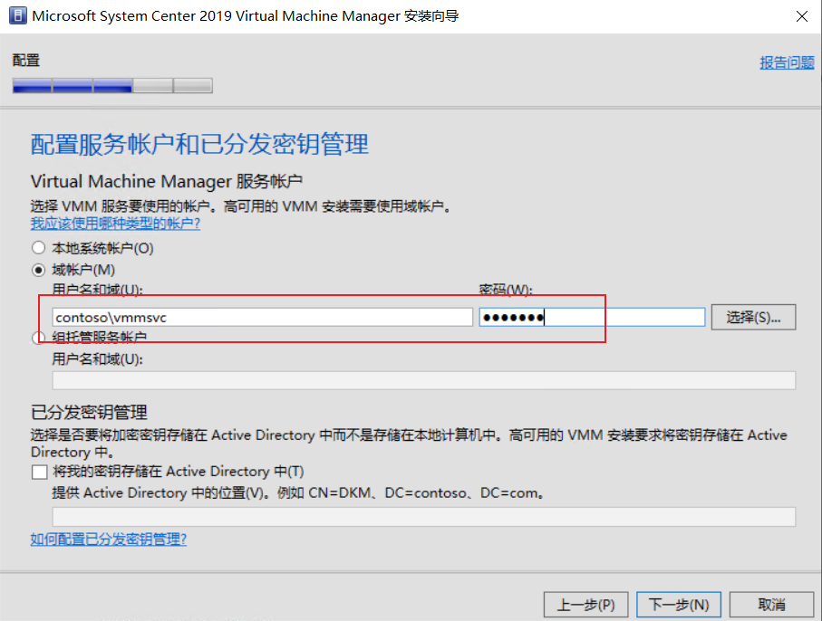
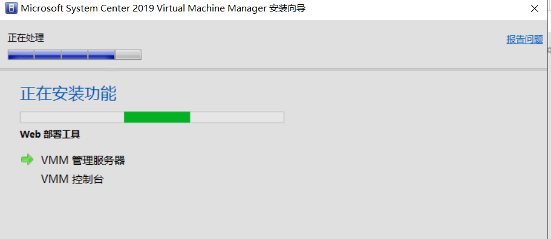
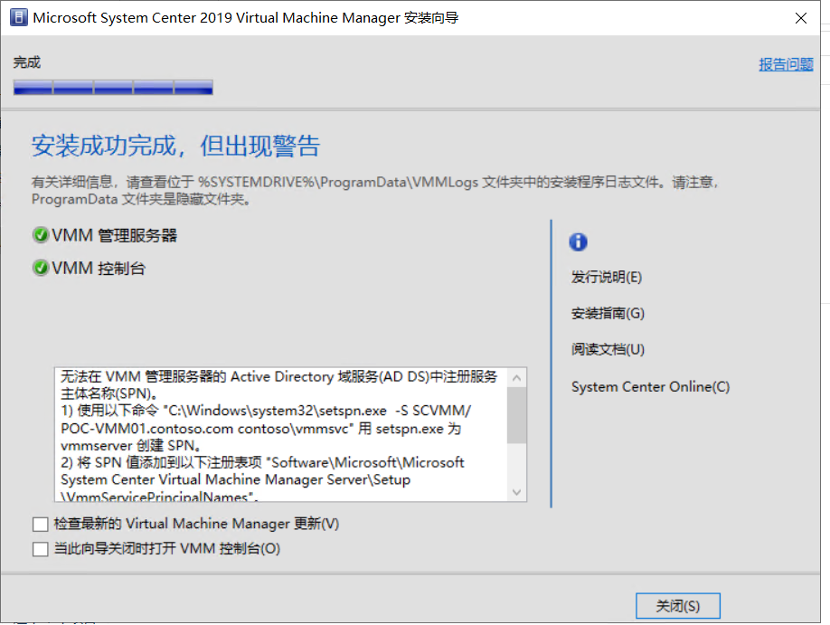

# Virtual Machine Manager

完成`数据库`的创建后，可以开始创建VMM虚拟机。创建 一台虚拟机，进行如下配置。

VMM是用来管理物理节点、以及后期配置的SDN/S2D的管理平台。

| 虚拟机主机名称 | 功能      | IP          | 掩码          | DNS         | 网关        | CPU  | 内存 | 硬盘                |
| -------------- | --------- | ----------- | ------------- | ----------- | ----------- | ---- | ---- | ------------------- |
| POC-VMM01      | VMM服务器 | 192.148.0.5 | 255.255.255.0 | 192.148.0.2 | 192.148.0.1 | 2    | 2G   | 至少40G，不足请扩容 |

## 配置本地管理员

将`vmmadmins`配置为`POC-VMM01`的本地管理员。操作请参考`账号体系约定`

## 加载VMM介质

在`Hyper-V管理器`中，选中`POC-VMM01`，右键点击，依次选`设置→SCSI控制器→DVD驱动器→添加`，在选项卡下，点击`映像文件→浏览`，指向提前准备好的`介质`，点击确定完成配置。

介质包含三个，需要`按照顺序`安装，由于现在MSDN已经没有ADK的下载链接，如果无法获取以下两个ADK的ISO，可以自行参考`软件配置`章节来获取离线完整文件。

| 功能   | 名称                                                         |
| ------ | ------------------------------------------------------------ |
| ADK    | en_windows_10_assessment_deployment_kit_version_2004_x86_arm64_x64_dvd_395452df.iso |
| ADK.PE | en_windows_pe_add-on_for_windows_10_assessment_deployment_kit_version_2004_x86_arm64_x64_dvd_b79c1104.iso |
| 主程序 | mu_system_center_virtual_machine_manager_2019_x64_dvd_06c18108.iso |

## 安装VMM

使用vmmamdin登录`POC-VMM01`这台虚拟机。

先加载ADK介质。如果是下载的离线介质，可以通过[在 HyperV中启用增强会话](https://docs.microsoft.com/en-us/windows-server/virtualization/hyper-v/learn-more/use-local-resources-on-hyper-v-virtual-machine-with-vmconnect)拷贝到虚拟机中。

双击介质中的`adksetup.exe`，一直点击下一步，直至如下界面，勾选`部署工具`，点击`安装`继续。

耐心等待安装结束，如下图所示。

弹出ADK介质，加载ADK.PE。

双击介质中的`adkwinpesetup.exe`，一直点击下一步，直至如下界面，点击`install`进行安装,耐心等待安装结束。

弹出ADK.PE介质，加载VMM主程序。

双击介质中的SCVMM_2019,一直点击下一步，将数据解压至`c:\System Center Virtual Machine Manager`，如下图所示。

弹出VMM主程序介质，前往`c:\System Center Virtual Machine Manager`。运行setup.exe，如下图所示，选择`安装`

进行如下勾选，点击`下一步`继续。接下来不需要输入序列号，试用版可以使用`180天`。

一直点击下一步，直至下图配置数据库服务器，输入`poc-sql01`，其他选项不修改，点击`下一步`继续。

配置服务账号，请输入`contoso\vmmsvc`，并输入密码。由于不涉及高可用，分发密钥不用做配置。点击`下一步`继续。

一直点击下一步，直至如下界面，点击`安装`

## 检查

出现如下图所示，即表示安装成功，取消勾选，点击关闭即可。

## 课后习题

- 当出现如上图所示的检查阶段提示时（SPN注册错误），尝试手动修复，以及检查注册表所在的真实位置。
- 查找SPN所代表的意义，以及丢失SPN可能会造成的问题。
- 安装阶段如果不输入序列号，能够使用多少天。
- 如果不输入序列号进行安装，后期如何激活。
