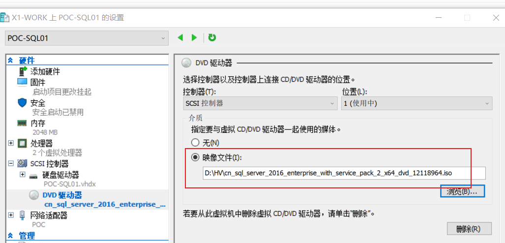
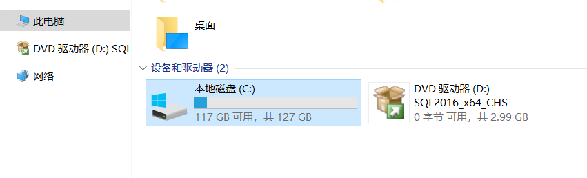
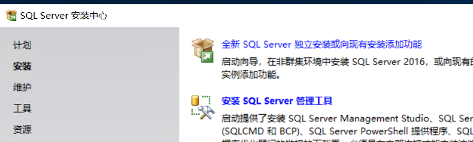
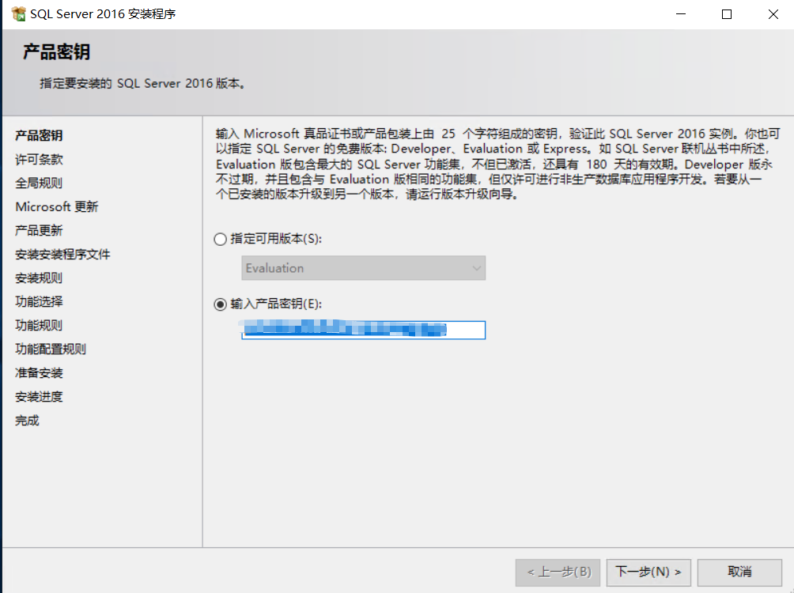
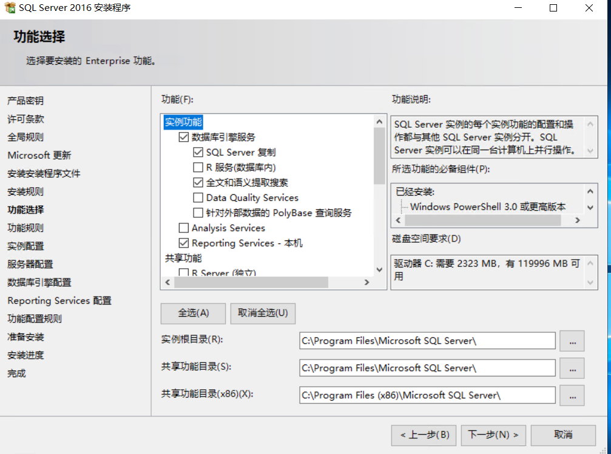
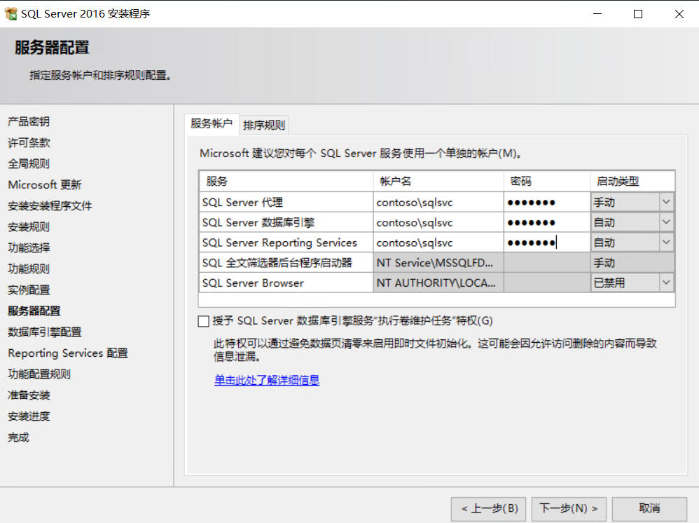
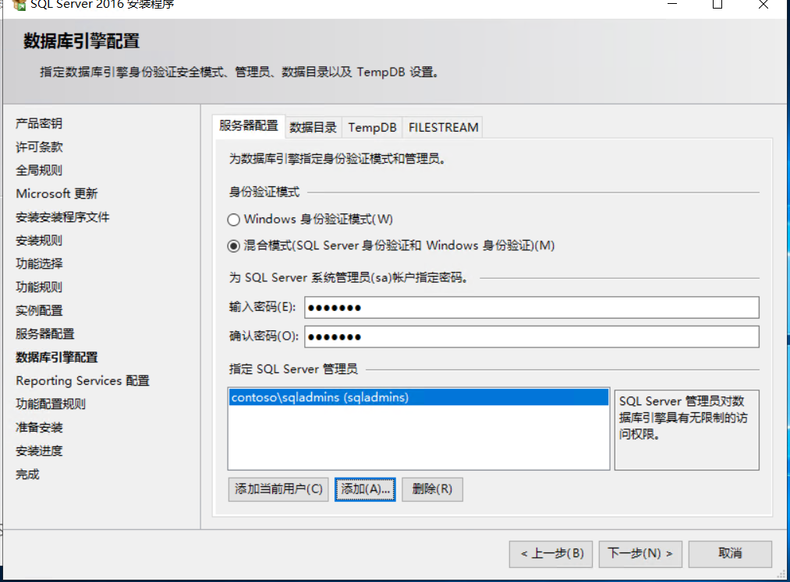
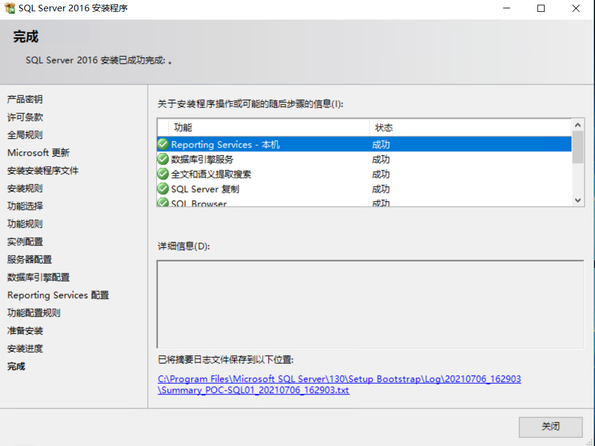

# SQLServer

完成Active Directory的创建，以及基础账号配置后，可以开始创建SQL Server虚拟机。创建 一台虚拟机，进行如下配置。

| 虚拟机主机名称 | 功能         | IP          | 掩码          | DNS         | 网关        | CPU  | 内存 | 硬盘                |
| -------------- | ------------ | ----------- | ------------- | ----------- | ----------- | ---- | ---- | ------------------- |
| POC-SQL01      | 数据库服务器 | 192.148.0.4 | 255.255.255.0 | 192.148.0.2 | 192.148.0.1 | 2    | 2G   | 至少20G，不足请扩容 |

## 配置本地管理员

将`sqladmins`配置为`POC-SQL01`的本地管理员。操作请参考`账号体系约定`

## 加载SQL介质

在`Hyper-V管理器`中，选中`POC-SQL01`，右键点击，依次选`设置→SCSI控制器→DVD驱动器→添加`，在选项卡下，点击`映像文件→浏览`，指向提前准备好的`cn_sql_server_2016_enterprise_with_service_pack_2_x64_dvd_12118964.iso`，点击确定完成配置

## 安装SQL

使用sqladmin登录`POC-SQL01`这台虚拟机。此时双击D盘，加载介质，运行目录中的setup.exe

依次点击`安装→全新SQL Server独立安装或向现有安装添加功能`

由于现阶段SQL Server的介质，根据产品类型不同，已经预置了序列号，因此只要是合法获取的介质，不需要管序列号的问题，这里会默认自动加载。点击`下一步`继续。

一直点击下一步，直至如下界面。期间由于没有互联网，会有`update失败`、以及`.net应用安全性警告`，全部忽略。

根据图示进行勾选，点击`下一步`继续。

一直点击下一步，直至如下界面。`严格`按照如下图示配置，并输入`账号密码`。

由于使用的中文版SQL，这里需要注意`修改排序规则`，在如上界面中，点击`排序规则`选项卡,选择`SQL_LAtin1_General_CP1_CI_AS`排序规则，并点击确定。点击`下一步`继续。

> 现阶段来看，英文版是不需要做这个修改的，该修改只在中文版中需要注意。

在`服务器配置`选项卡下，选择`混合模式`，并输入密码。点击添加按钮，增加`contoso\sqladmins`安全组。点击`下一步`继续。

一直点击下一步，直至开始安装，耐心等待安装结束。

## 检查

出现如下提示，即表示安装成功完成

最后，需要在磁盘管理器中，将SQL的ISO`弹出`。

