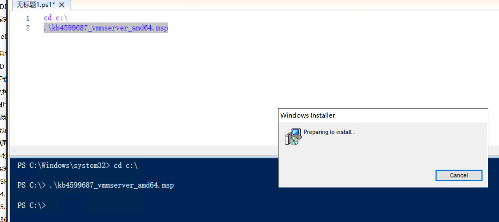
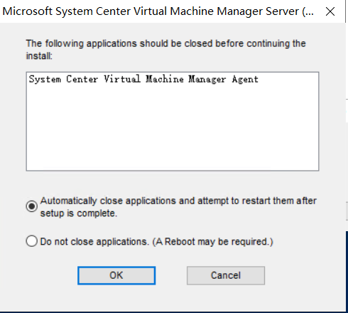
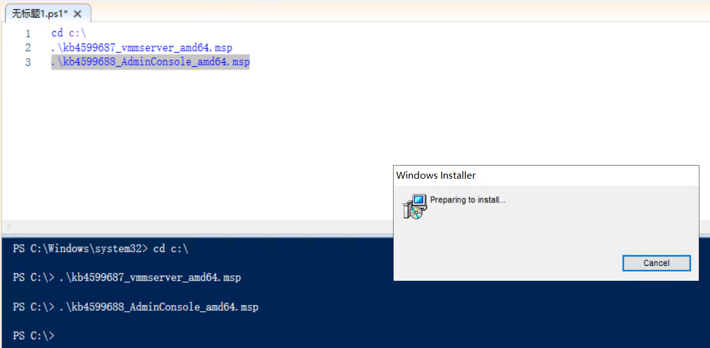
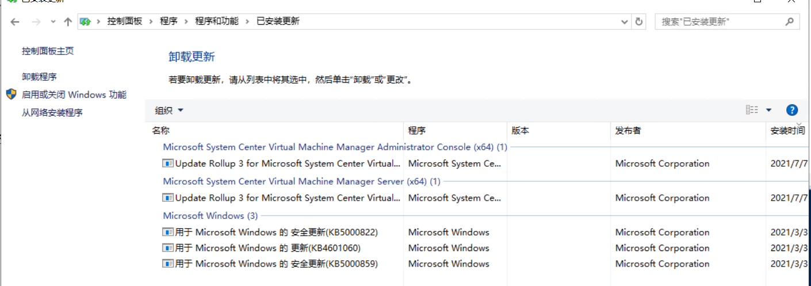

# VMM UR补丁

System Center 的补丁定期半年一次更新，截止现在，VMM2019最新的补丁是UR3。

| 补丁链接与名称                                               |
| ------------------------------------------------------------ |
| [汇总页： Update Rollup 3 for System Center 2019](https://support.microsoft.com/en-us/topic/update-rollup-3-for-system-center-2019-f56b2cb0-51a8-4e30-9d6c-cd6d02184a26?WT.mc_id=AZ-MVP-4038157) |
| [4599687 Update Rollup 3 for System Center 2019 Virtual Machine Manager](https://support.microsoft.com/topic/2eea517c-bd0f-dfe8-2c70-28fa4ac6b0c1) |
| [4594078 Update Rollup 3 for System Center 2019 Operations Manager](https://support.microsoft.com/topic/a7b9aa06-7d72-dc5a-e303-1899fafe9931) |
| [5001202  Update Rollup 3 for System Center 2019 Data Protection Manager](https://support.microsoft.com/topic/fa5eb310-1886-43fb-be5d-c7829bfaf63d) |
| [4599686 Update Rollup 3 for System Center 2019 Orchestrator](https://support.microsoft.com/en-us/topic/update-rollup-3-for-system-center-2019-orchestrator-70bc1df6-adbc-9b89-68bf-df5a6eefca5f) |

## 获取补丁

根据链接，获取如下两个文件。

kb4599687_vmmserver_amd64_b868c6d441a6e020248b50b9176570bb01f22209.cab

kb4599688_adminconsole_amd64_b12ef35b4b1abd89c6c042fea4fc37d3b8089ac8.cab

拷贝至VMM虚拟机中，经过`解压`后，可以获取到如下`两个文件`

kb4599687_vmmserver_amd64.msp

kb4599688_AdminConsole_amd64.msp

## 安装

需要使用`管理员的PowerShell`来执行升级补丁。

将补丁拷贝到`特定目录`，通过如下方式`运行补丁`

```powershell
cd c:\
.\kb4599687_vmmserver_amd64.msp
```




期间会提示VMM的Agent阻止，直接点击`OK`。




耐心等待安装完成，补丁程序会自动消失。

继续运行控制台的补丁

```powershell
cd c:\
.\kb4599688_AdminConsole_amd64.msp
```




## 检查

打开`文件资源管理器`，于地址栏输入`控制面板\程序\程序和功能`，点击左侧的`查看已安装的更新`，正常情况应该出现如下所示的内容，包含`两条`SCVMM UR3的条目。


